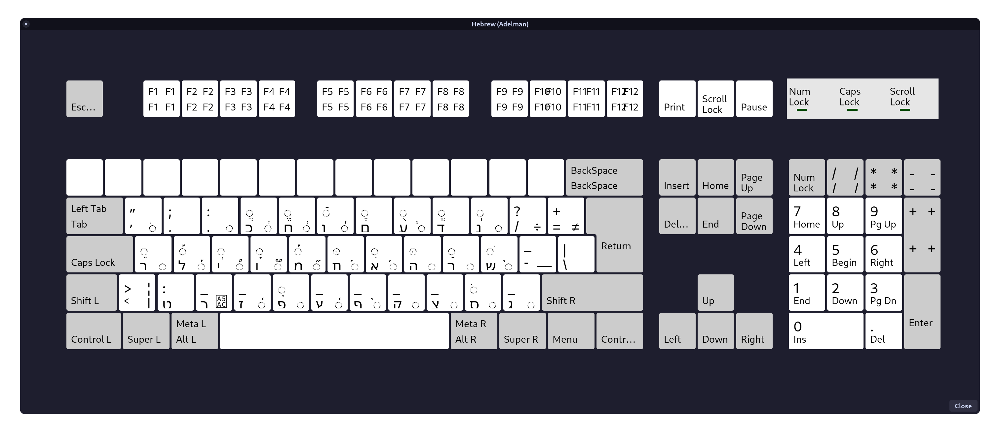

# Adelman Hebrew Keyboard Layout
[Aaron Solomon Adelman][adelman]'s ergonomic Hebrew keyboard layout, with some 
minor modifications by Benny Powers.

Presented as-is for xkb users.



## Installation

Append the definition to your system-wide xkb Hebrew layouts file.

```sh
sudo cat adelman.xkb >> /usr/share/X11/xkb/symbols/il
```

Or otherwise copy the contents in (perhaps with `sudoedit`)

I don't believe it's possible to do this on a per-user basis because of 🌈
*principles* 🦄 or something *very important* like that.

Next, copy the variant configs. These are modified from the versions available
in Fedora 38. I take no responsibility for breaking your system here, so beware,
since once again: **principles**.

```sh
sudo cp evdev.lst /usr/share/X11/xkb/rules/
sudo cp evdev.xml /usr/share/X11/xkb/rules/
```

Log out and back in again, *et voila*: הקלדה נוחה וארגונומית בעברית

[adelman]: https://web.archive.org/web/20160927075343/https://sites.google.com/site/aaronsolomonadelman/adelmankeyboard
